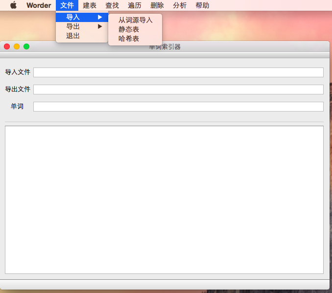

基于Qt的单词索引器-QtWorder
=
将之前的控制台界面项目Worder整合成为GUI项目(带有浓重c色彩的c++代码...
### 开发环境
OS: OS X 10.10.5 
Qt: Qt 5.8.0 
Compile: LLVM version 7.0.0 (clang-700.1.76) 
C/C++
### 运行

#### 关于
一个纯中文的软件，就用中文介绍了。一周时间做的GUI，不是很漂亮，但也确实煞费苦心，算是图形界面编程入了门吧。